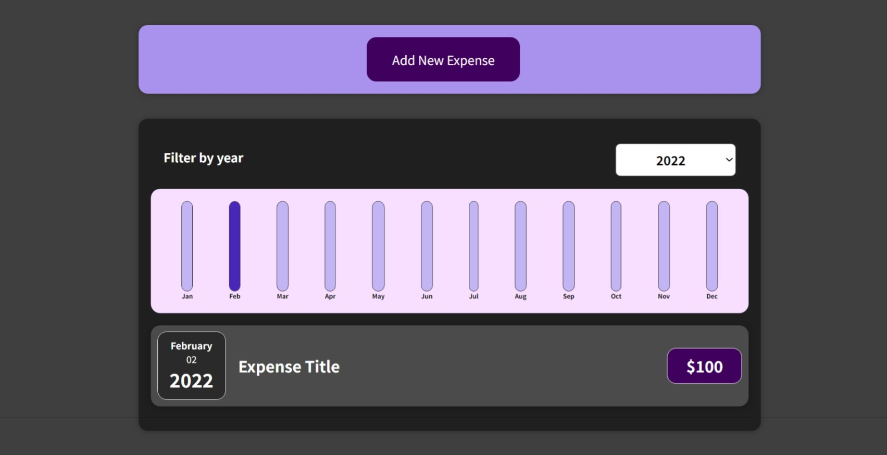
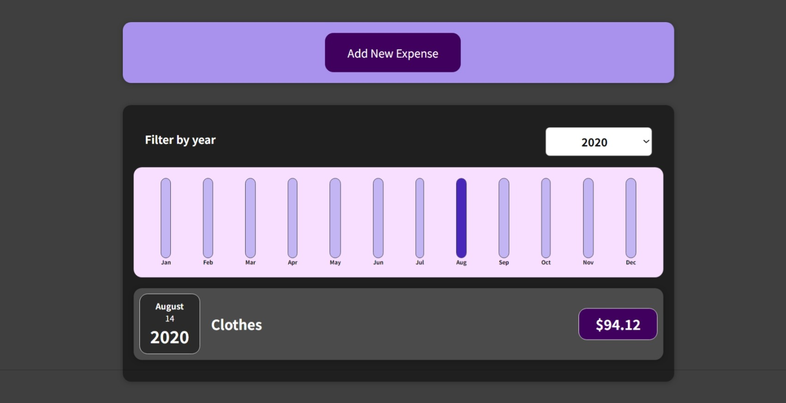
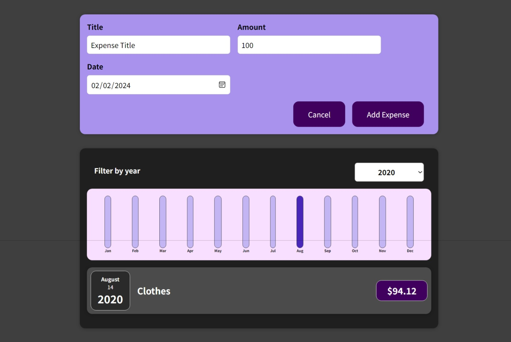

### Expense Tracker Application

Project based on **React.js**, just a simple application works in a local environment which can track expense information based on the **date** in a specific **year**.

### Pre Requisites

- **Node.js** version **21** or greater.

### Dependencies used by the project

1. **react**.
2. **jest**.

### Available scripts

1. `npm start` for running the application in local environment.

### Instructions

1. Visit `http://localhost:3000` in the browser.

2. Home page of the application will display all the expenses in the very first year. 

3. Click on the **Add Expense** button to add a new expense, here is a sample example. 

4. Apply the year filter to see the newly added expense. 
